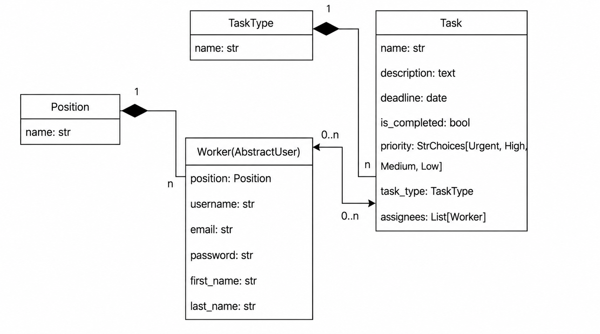
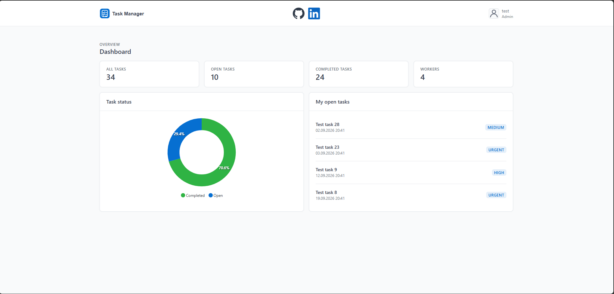
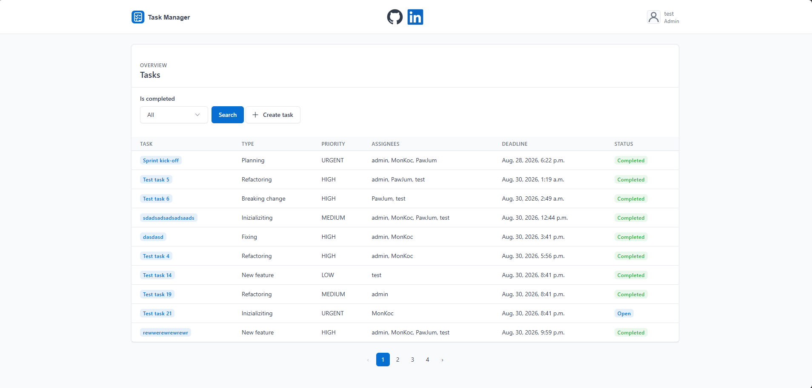
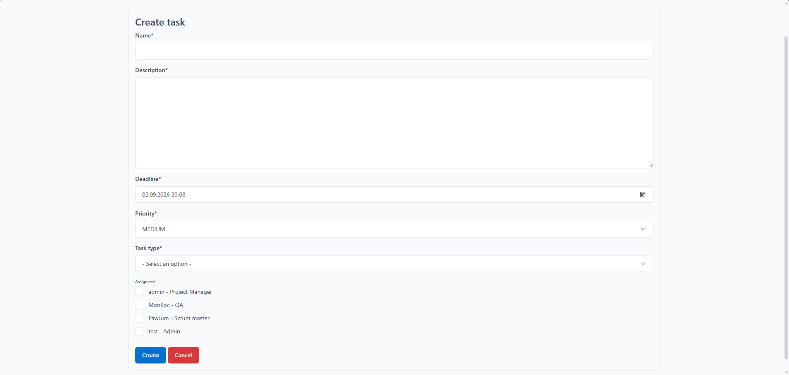
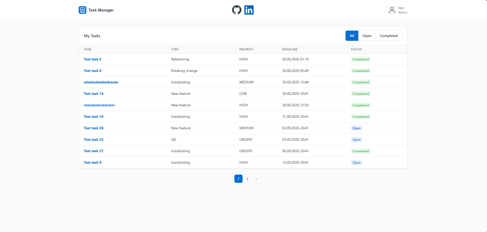
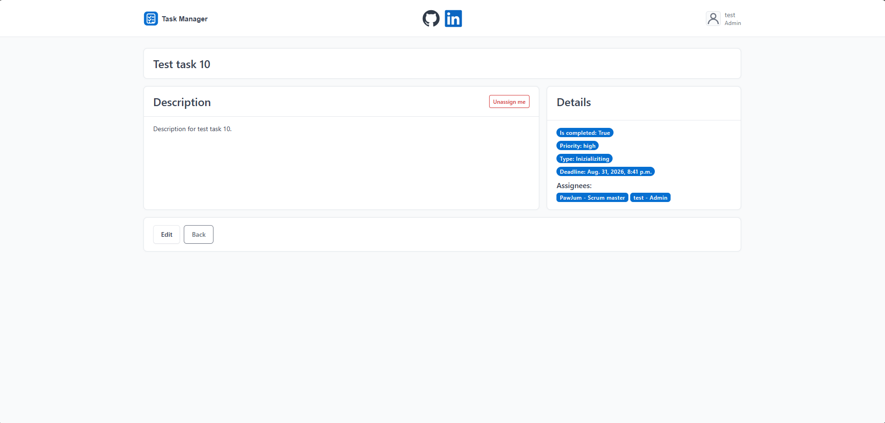

# it_company_task_manager

A Django-based task management application designed for IT teams.
It allows team members to create tasks, assign them to workers,
manage deadlines and priorities, and track task completion.

## Features

- User authentication
- Custom worker model with positions
- Create and update tasks
- Assign multiple workers to tasks
- Self-assign / unassign from tasks
- Mark tasks as completed
- Task priorities and task types
- Task deadlines with validation
- Filter tasks by completion status
- Personal "My Tasks" view
- Pagination
- Dashboard with task statistics
- Task status chart
- Django admin integration
- Custom 404 page

## Tech stack

- Python
- Django
- Django ORM
- SQLite
- Django Templates
- Bootstrap 5
- Tabler UI
- django-crispy-forms
- ApexCharts
- GitHub Actions
- Black
- isort
- Flake8

## Data Model

The application is based on four main models:

- `Worker` - custom Django user model representing an IT team member.
- `Position` - represents the worker's role within the company.
- `TaskType` - defines the category of a task.
- `Task` - represents work assigned to one or multiple workers and contains priority, deadline and completion status.

A worker can be assigned to multiple tasks and a task can have multiple workers.



## Screenshots

### Dashboard


### Task List


### Create Task


### My Tasks


### Task Details


## Installation

Clone the repository and enter the project directory:

```bash
git clone https://github.com/kuligambino01/it_company_task_manager.git
cd it_company_task_manager
```

Create a virtual environment to keep the project dependencies isolated:

```bash
python -m venv .venv
```

Activate the virtual environment.

Windows PowerShell:

```bash
.venv\Scripts\Activate.ps1
```

Windows CMD:

```bash
.venv\Scripts\activate
```

Linux / macOS:

```bash
source .venv/bin/activate
```

Install the application together with the development dependencies defined in `pyproject.toml`:

```bash
python -m pip install -e ".[dev]"
```

Create a `.env` file based on `.env.example` and provide the required environment variables.

Apply the existing database migrations:

```bash
python manage.py migrate
```

Optionally populate the application with demo data:

```bash
python manage.py seed_demo_data
```
The command creates demo users, positions, task types, and tasks for testing the application.

Example demo account:

```text
Username: developer
Password: demo1234
```

Optionally create an administrator account to access the Django admin panel:

```bash
python manage.py createsuperuser
```

Run the local development server:

```bash
python manage.py runserver
```

Open the application in your browser:

```text
http://127.0.0.1:8000/
```

## Tests

Run the test suite:

```bash
python manage.py test
```

## Continuous Integration

The project uses GitHub Actions to automatically run:

- Black formatting checks
- isort import checks
- Flake8 linting
- Django system checks
- Test suite

## Code Quality

Format the code with Black:

```bash
black .
```

Sort imports with isort:

```bash
isort .
```

Check the code with Flake8:

```bash
flake8 .
```

## Usage

After starting the development server, log in to the application using a registered user account.

The application allows users to:

- View all tasks
- Create new tasks
- Update existing tasks
- Assign tasks to multiple workers
- Assign or unassign themselves from a task
- Mark tasks as completed
- Filter tasks by completion status
- View tasks assigned to the currently logged-in user
- Monitor basic task statistics from the dashboard

## Future Improvements

Planned extensions:

- Task tags using a many-to-many relationship
- More advanced filtering and sorting
- Projects
- Teams
- Project-specific task management
- Additional dashboard statistics

## Author

Cezary Kulig

- GitHub: [kuligambino01](https://github.com/kuligambino01)
- LinkedIn: [Cezary Kulig](https://www.linkedin.com/in/cezary-kulig-03b184269/)